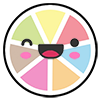
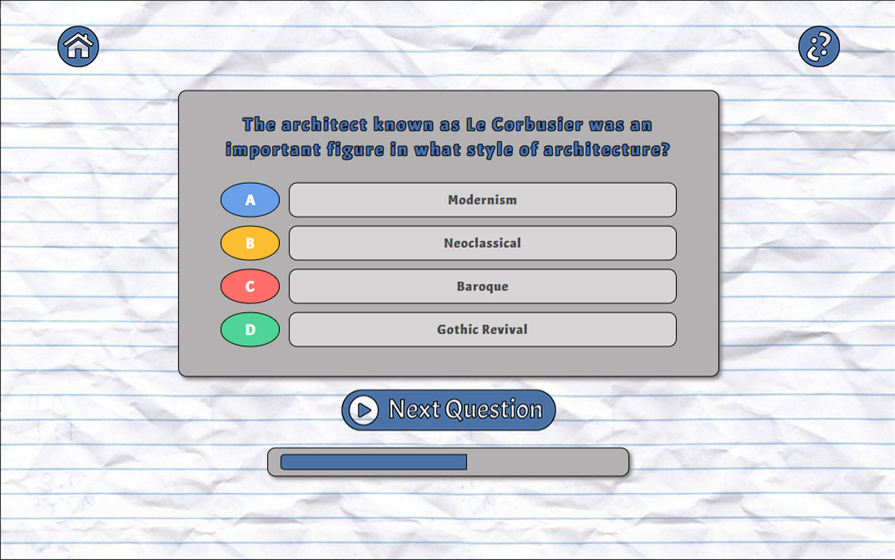
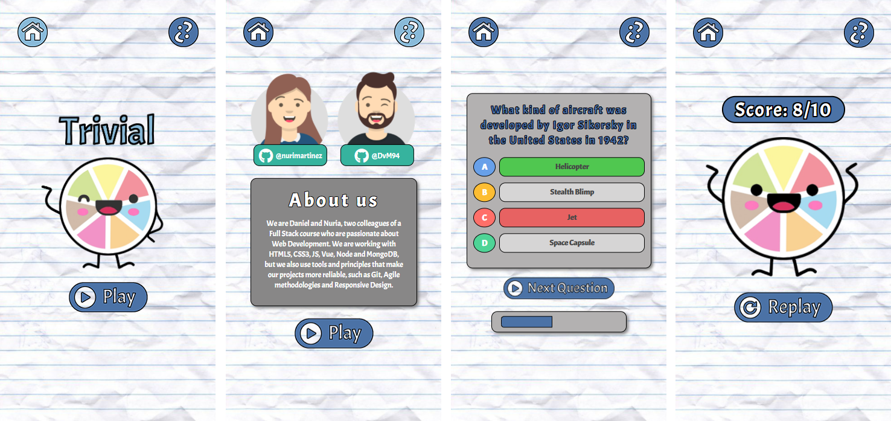

# El ahorcado

## Descripción

Juego estilo trivial con 10 preguntas de cultura general en inglés, obtenidas del consumo de la API Open Trivia.
La aplicación sigue los principios del diseño responsive, está en formato ordenador y móvil. Está realizada con Vue3, siendo una **Single-page application**. El resultado final varía según el número de aciertos.

## Caracerísticas

* HTML5, CSS3, JS
* SCSS
* [Trivia API](https://opentdb.com/api_config.php)

* [Vue.js](https://v3.vuejs.org/)

* [Composition API](https://v3.vuejs.org/api/composition-api.html)

## Colaboraciones

